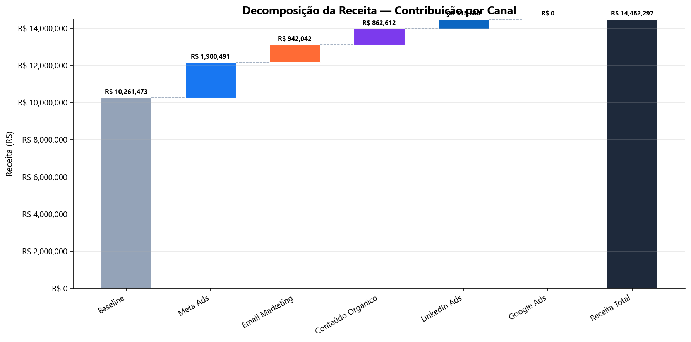
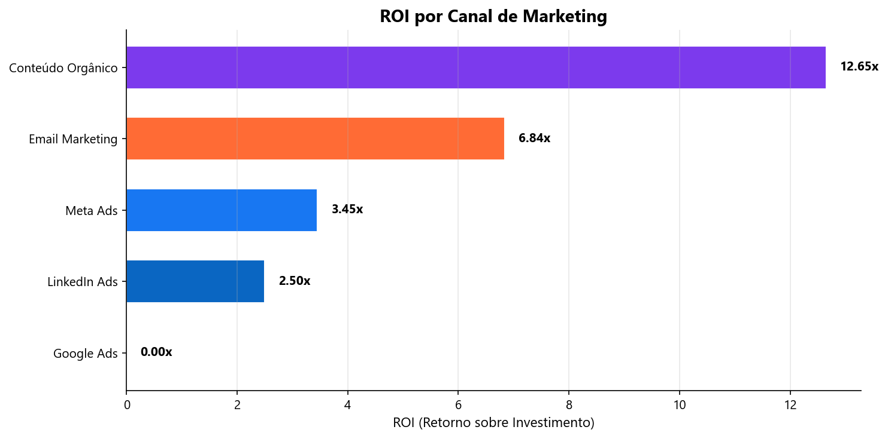
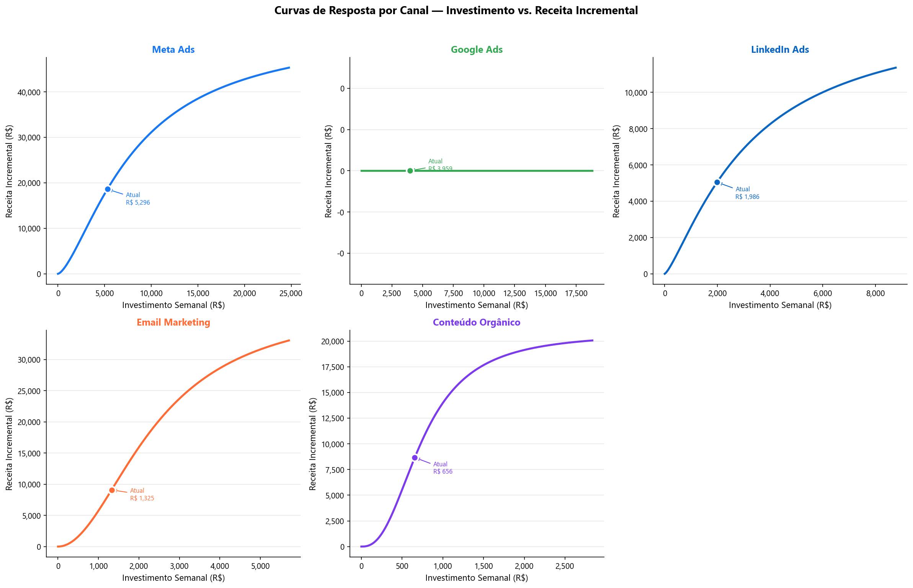
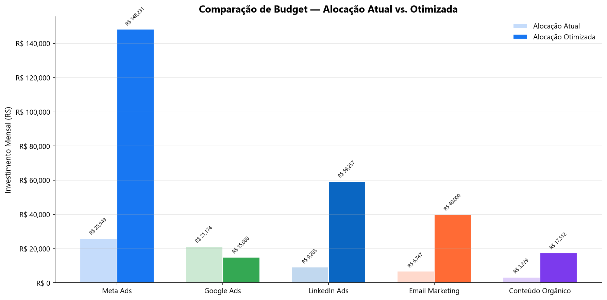
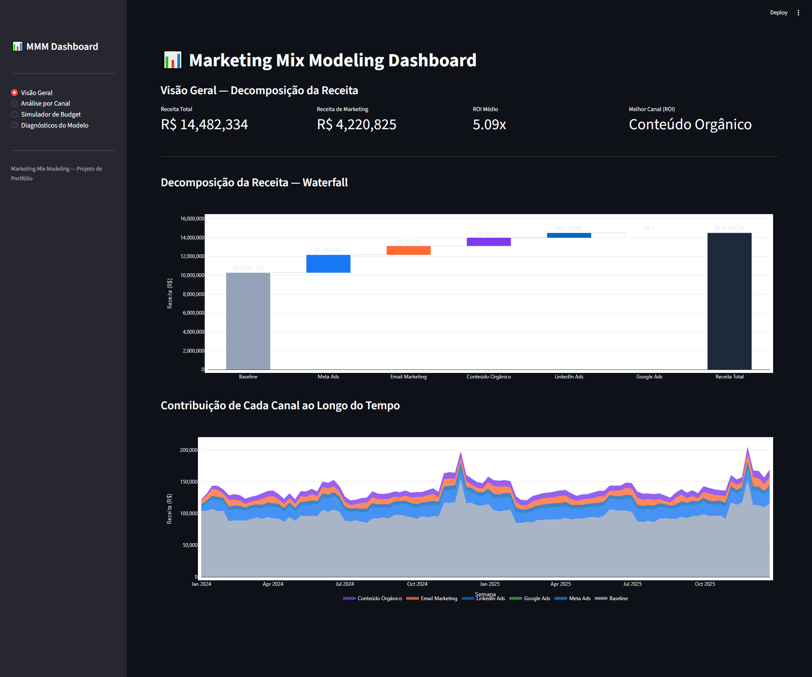

# 📊 Marketing Mix Modeling — Decodificando o Impacto Real de Cada Canal


<p align="center">
  
</p>

## O Problema

Toda empresa que investe em marketing enfrenta a mesma pergunta: **de onde realmente vem a receita?**

Atribuição por último clique mente. Cookies estão morrendo. E o diretor financeiro quer saber se aquele investimento em Meta Ads justifica o custo — ou se o dinheiro renderia mais em outro canal.

Marketing Mix Modeling resolve isso. Usando regressão sobre dados agregados semanais, o modelo separa o que é venda orgânica do que cada canal realmente gerou. Sem depender de cookies, sem rastreamento individual, sem achismo.

Este projeto implementa um pipeline completo de MMM: da geração de dados até a otimização de budget, passando por diagnósticos estatísticos e um dashboard interativo.

## Metodologia

O modelo segue a mesma base conceitual dos frameworks de referência do mercado (Meridian do Google, Robyn da Meta), com implementação própria em Python.

**Em resumo:**

1. **Adstock geométrico** — modela o efeito residual de mídia. Um anúncio visto na segunda ainda impacta na quarta.
2. **Saturação de Hill** — captura retornos decrescentes. Dobrar o investimento não dobra a receita.
3. **Regressão OLS** — com fallback de otimização restrita para garantir que nenhum canal tenha coeficiente negativo.
4. **Otimização SLSQP** — redistribui o budget entre canais para maximizar a receita prevista.

Para a documentação técnica completa com fórmulas e referências, veja [docs/methodology.md](docs/methodology.md).

## Resultados Principais

### Qualidade do modelo

| Métrica | Valor |
|---------|-------|
| R² | 0.8833 |
| R² ajustado | 0.8707 |
| MAPE | 3.16% |
| Durbin-Watson | 2.025 |

O modelo explica ~88% da variância da receita, com erro médio de 3%. Os resíduos não apresentam autocorrelação relevante.

### ROI por canal — quem entrega mais por real investido

<p align="center">
  
</p>

Conteúdo Orgânico e Email Marketing lideram o ROI, mas recebem a menor fatia do budget. Meta e Google Ads consomem ~70% do orçamento mas já operam na zona de saturação.

### Curvas de resposta — onde está o ponto de saturação

<p align="center">
  
</p>

As curvas mostram claramente onde cada canal começa a saturar. Canais na parte íngreme da curva têm espaço pra crescer; canais no platô já entregam o máximo.

### Otimização de budget — ganho sem gastar mais

<p align="center">
  
</p>

Apenas redistribuindo o mesmo budget (R$ 66 mil/mês), o modelo projeta um ganho de **+R$ 83 mil/mês (+13%)** em receita. A lógica: tirar dos canais saturados e colocar nos que ainda têm margem.

## Como Usar

```bash
# 1. Clone o repositório
git clone https://github.com/luizdanilo/MarketingMixModeling.git
cd MarketingMixModeling

# 2. Crie e ative o ambiente virtual
python -m venv .venv
.venv\Scripts\activate  # Windows
# source .venv/bin/activate  # Linux/Mac

# 3. Instale as dependências
pip install -r requirements.txt

# 4. Rode os notebooks na ordem
jupyter notebook notebooks/

# 5. Rode os testes
pytest tests/ -v

# 6. Abra o dashboard
streamlit run dashboard/app.py
```

## Como Usar com Seus Próprios Dados

O projeto foi feito com dados sintéticos, mas adaptar pra dados reais é direto:

1. **Substitua o CSV** em `data/raw/marketing_data.csv` pelo seu arquivo, mantendo as mesmas colunas (ou ajuste os nomes em `src/model.py`).

2. **Calibre os hiperparâmetros** em `src/transformations.py` — o `DEFAULT_CHANNEL_PARAMS` define o decay, half-saturation e slope de cada canal. Com dados reais, use validação cruzada ou grid search pra encontrar os melhores valores.

3. **Ajuste os bounds do otimizador** em `src/optimizer.py` — os pisos e tetos (`DEFAULT_MIN_PER_CHANNEL`, `DEFAULT_MAX_PER_CHANNEL`) devem refletir as restrições reais do seu negócio (contratos mínimos, capacidade operacional).

4. **Rode o pipeline** normalmente pelos notebooks ou dashboard.

## Dashboard

<p align="center">
  
</p>

Dashboard interativo com 4 páginas:

- **Visão Geral** — KPIs, decomposição waterfall e contribuição ao longo do tempo
- **Análise por Canal** — curva de resposta, efeito adstock e parâmetros de cada canal
- **Simulador de Budget** — sliders para testar alocações e otimizador automático
- **Diagnósticos** — métricas estatísticas, gráficos de resíduos e tabela de VIF

```bash
streamlit run dashboard/app.py
```

## Tech Stack

| Categoria | Tecnologias |
|-----------|------------|
| Linguagem | Python 3.10+ |
| Dados | Pandas, NumPy |
| Modelagem | Statsmodels, SciPy, Scikit-learn |
| Visualização | Plotly, Matplotlib, Seaborn |
| Dashboard | Streamlit |
| Testes | Pytest |
| Banco de dados | SQLAlchemy |

## Estrutura do Projeto

```
MarketingMixModeling/
├── src/
│   ├── data_generator.py      # Gerador de dados sintéticos
│   ├── transformations.py     # Adstock geométrico e saturação de Hill
│   ├── model.py               # Modelo MMM (OLS + fallback restrito)
│   ├── optimizer.py           # Otimizador de budget (SLSQP)
│   └── visualizations.py      # 7 funções de visualização (Plotly + PNG)
├── notebooks/
│   ├── 01_EDA_exploratory_analysis.ipynb
│   ├── 02_modeling_mmm.ipynb
│   ├── 03_budget_optimization.ipynb
│   └── 04_results_presentation.ipynb
├── dashboard/
│   └── app.py                 # Dashboard Streamlit (4 páginas)
├── tests/
│   └── test_model.py          # 6 testes com pytest
├── data/
│   └── raw/
│       └── marketing_data.csv # Dataset sintético (104 semanas)
├── docs/
│   ├── methodology.md         # Documentação técnica completa
│   └── images/                # Gráficos gerados (15 PNGs)
├── requirements.txt
└── README.md
```

## Referências

- Jin, Y., et al. (2017). *Bayesian Methods for Media Mix Modeling with Carryover and Shape Effects*. Google Inc.
- Chan, D. & Perry, M. (2017). *Challenges and Opportunities in Media Mix Modeling*. Google Inc.
- [Meridian](https://github.com/google/meridian) (Google) — MMM bayesiano em Python/JAX.
- [Robyn](https://github.com/facebookresearch/Robyn) (Meta) — MMM automatizado em R.
- [PyMC-Marketing](https://github.com/pymc-labs/pymc-marketing) (PyMC Labs) — MMM bayesiano com PyMC.

## Autor

**Luiz Danilo de Almeida**

[](https://www.linkedin.com/in/luizdanilodealmeida/)
[](https://github.com/luizdanilo)
[](mailto:luizdanilo078@gmail.com)

---

*Projeto desenvolvido como portfólio de Data Science & Marketing Analytics.*
